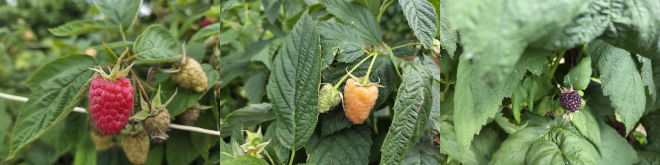
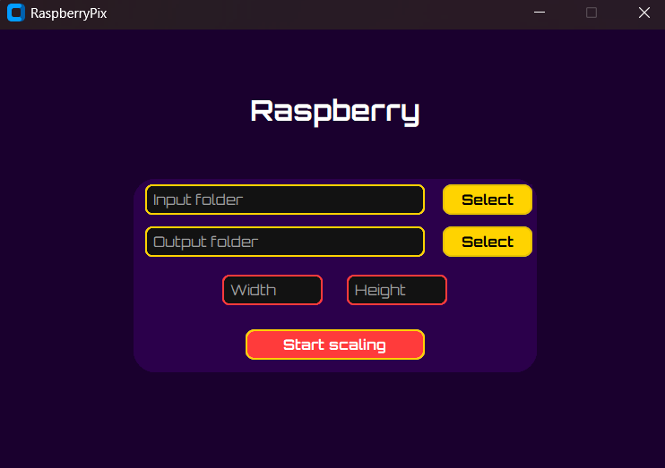
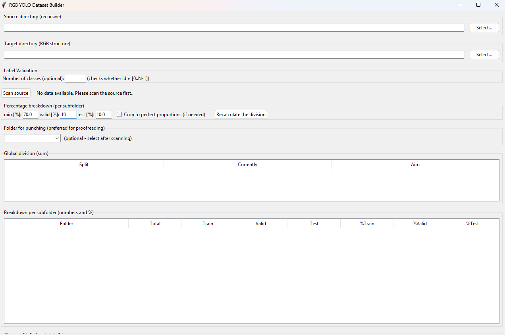

  

 This repository contains all preprocessing, training, and evaluation scripts used in the study “Detection of Red, Yellow, and Purple Raspberry Fruits Using YOLO Models”. The project evaluates YOLOv8s, YOLOv9s, YOLOv10s YOLO11s and YOLO12s models for the detection red, yellow and purple raspberry fruits RGB imagery acquired with a Samsung Galaxy S25 and Gimbal Hohem iSteady M7.

## Citation
If you use this repository, please cite:
--It will be available after publication--

### `01_ImageScaling.py`
Graphical application for batch image resizing using OpenCV and CustomTkinter. Provides an intuitive dark-themed GUI for selecting input/output directories and defining target image dimensions. Supports multiple formats (`.jpg`, `.png`, `.bmp`, `.tiff`) with automatic folder creation, error handling, and safe I/O operations. Designed for standardized dataset preparation and image normalization prior to YOLO-based deep learning model training.

  

### `02_DataSetsOrganizer.py`
Advanced graphical tool for automated organization and validation of YOLO-format RGB datasets. Scans nested directories to locate image–label pairs, validates bounding box consistency, and enforces label syntax rules (`id x y w h ∈ [0,1]`). Provides per-folder data balancing with configurable training/validation/test splits and an optional “knockout” folder for aspect ratio fine-tuning. Generates CSV reports summarizing dataset integrity, split ratios, and per-class instance counts. Features a Tkinter-based GUI with dynamic tables, progress logs, and interactive data preview for dataset curation and export. Designed for building high-quality YOLO datasets with guaranteed structural and statistical correctness prior to training.

  

### `03_Training.py`
Comprehensive YOLO training pipeline integrating environment diagnostics, dataset validation, and model training configuration. Performs system checks for Python, PyTorch, CUDA, cuDNN, and GPU availability to ensure optimized hardware utilization. Validates YOLO dataset directory structure (`images/labels` across `train`, `val`, `test`) and dynamically generates a `data.yaml` file. Implements customizable YOLO training using the Ultralytics framework with adjustable hyperparameters such as optimizer type, learning rate, batch size, and epoch count.Designed for reproducible experiments on CUDA-enabled hardware (e.g., RTX, Jetson) and efficient benchmarking of model architectures under controlled conditions.

### `04_Model_evaluation_using_test_sets.py`
Evaluation and benchmarking pipeline for trained YOLO models on designated test datasets. Performs CUDA hardware validation to ensure GPU-based inference and initializes model evaluation using Ultralytics’ YOLO API.  Computes both global and per-class performance metrics including precision, recall, F1-score, and mean average precision (mAP@0.5, mAP@[.5:.95]). Outputs detailed evaluation results as structured CSV reports (`metrics_summary_testset.csv`, `metrics_per_class.csv`) and serialized JSON prediction data for reproducibility. Automatically detects and loads the test dataset from the `data.yaml` configuration, executes detection on all test images, and saves annotated outputs for qualitative analysis. Designed for systematic comparison of multiple trained YOLO architectures and validation of detection robustness across distinct datasets and color domains.

### `05_RTX_5080-performance_TORCH.py`
High-performance evaluation script optimized for YOLO model benchmarking on NVIDIA RTX 5080-class GPUs using the Torch backend. Performs automatic CUDA detection, GPU validation, and environment readiness checks prior to test set evaluation. Executes full validation against the YOLO test dataset (`split='test'`) to compute precision, recall, F1-score, and mean average precision (mAP@0.5, mAP@[.5:.95]). Generates detailed per-class and global performance summaries in CSV format, enabling reproducible metric comparison across models. Additionally performs inference over the entire test set, saving annotated detection outputs and structured JSON logs for downstream statistical analysis. Tailored for high-throughput GPU systems to support quantitative performance assessment of YOLO models under the Torch runtime.

### `06_Jetson_Orin_NX-performance_TORCH.py`
Lightweight, power-optimized benchmarking pipeline for YOLO models running on Jetson Orin NX (16 GB) with FP16 inference. Implements the same benchmarking methodology as RTX 5080 tests, adapted for embedded GPU constraints and thermally limited environments. Performs warm-up and timed inference loops to measure FPS, latency, and jitter with percentile trimming for outlier rejection. Includes automatic GPU stabilization, per-session cooldowns, and session-based result logging to prevent throttling and ensure consistency. Outputs detailed per-run and aggregated summaries (`.xlsx`), capturing mean, median, and statistical variation for multiple YOLO models. Designed for reproducible inference benchmarking of deep learning detectors on Jetson-class hardware under CUDA and FP16 precision.

### `07_Torch_TO_Tensor.py`
Automated conversion utility for exporting YOLO `.pt` models (PyTorch format) into optimized TensorRT `.engine` binaries. Recursively scans directories for trained YOLO checkpoints (`best.pt`), automatically categorizes them, and performs GPU-accelerated export. Employs FP16 precision with a 2 GB workspace limit and model simplification for maximum inference efficiency on NVIDIA hardware. Implements robust error handling, structured logging, and automatic directory creation to streamline multi-model conversion workflows. Designed for seamless integration into Jetson and RTX TensorRT deployment pipelines, enabling reproducible acceleration benchmarking and inference deployment.

### `08_Jetson_Orin_NX-performance_TENSOR.py`
Comprehensive TensorRT-based benchmarking suite for YOLO models running on Jetson Orin NX under FP16 precision. Implements a standardized measurement protocol identical to Torch-based tests for direct comparability across runtimes. Conducts inference benchmarking with warm-up, timing, and percentile-trimming to produce stable estimates of FPS, latency, and jitter. Includes automated GPU stabilization, session-based execution with enforced cooldowns, and per-session Excel logging for reproducibility. Aggregates all session outputs into a master `.xlsx` report containing statistical summaries and raw per-run performance data. Optimized for embedded GPU environments to quantify T

### `09_Torch_and_Tensor_PERFORMANCE_Analysis_Mean_Standard_Deviation.py`
Statistical post-processing module for analyzing YOLO benchmark results across Torch and TensorRT frameworks. Aggregates per-model performance data from `.xlsx` benchmark outputs to compute descriptive statistics including mean, median, and standard deviation. Calculates coefficients of variation (CV%) for FPS, latency, and mAP/FPS efficiency ratios to assess stability and reproducibility. Performs safe numeric conversion, NaN filtering, and column normalization for reliable cross-session comparison. Outputs a consolidated Excel report (`FINAL_RTX_STATISTICS_FIX.xlsx`) containing aggregated metrics for quantitative performance analysis. Supports reproducibility verification and comparative evaluation of model execution across different inference backends and hardware platforms.

